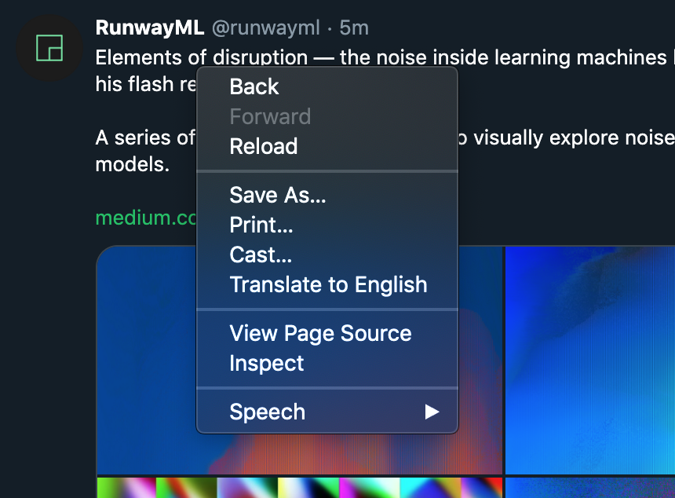
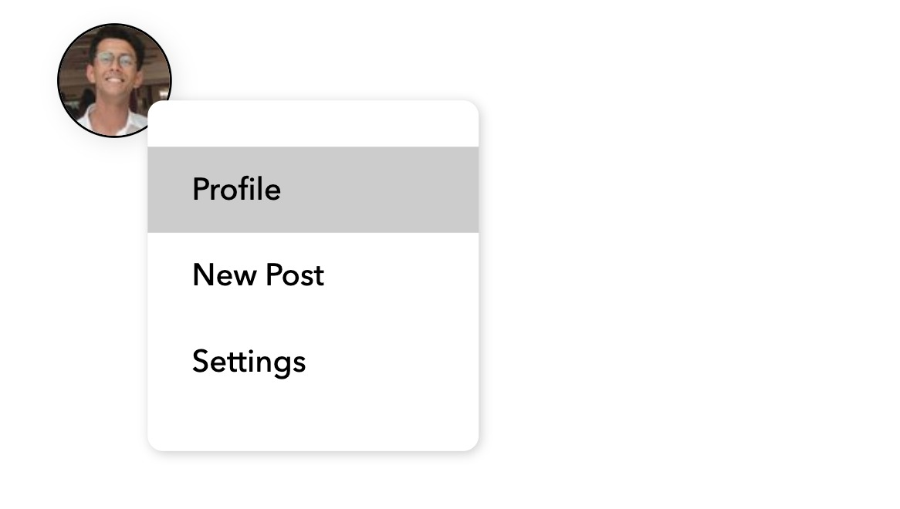

<p align="center">Add custom context menus to any webpage element with minimal coding!!!</p>
<p align="center"><strong>Made by <a target="blank_" href="http://rish-16.github.io/">Rishabh Anand</a> for <a target="blank_" href="https://openhack.nushackers.org/">NUS Hackers OpenHack 2020</a></strong></p>

<p align="center">
	
	<a href="https://opensource.org/licenses/MIT"></a>
</p>

---

### What is it?

> `Angelfire` lets you quickly build right-click-enabled context menus and drop-down menus for any element on your webpage.

Check it out on the [demo page](https://af-demo.netlify.app/).

**What Are Context Menus?**

A context menu is what shows up when you right-click something on a webpage. It usually contains actions that can be performed on the selected element.



<br>

Nowadays, many apps are using context menus to give users additional functionality without adding extra elements to the user interface. With a simple right-click, users have an array of extra options to choose from, improving the user experience by a large margin.

`Angelfire` lets you *hijack* this context menu and add in your own options instead. Now, you too can add some extra UX touches to your web app!

---

### Setting Up Angelfire

To use `Angelfire`, add the CDN links to your `head` tag of your markup:

```
https://cdn.jsdelivr.net/gh/rish-16/Angelfire/src/angel-styles.min.css
https://cdn.jsdelivr.net/gh/rish-16/Angelfire/src/angelfire.min.js
```

<br>

```html
<head>
	<meta charset="UTF-8">
	<meta name="viewport" content="width=device-width, initial-scale=1.0">
	<title>Page Title</title>
	
	<!-- Place the Angelfire assets here -->
	<link rel="stylesheet" href="https://cdn.jsdelivr.net/gh/rish-16/Angelfire/src/angel-styles.min.css">
	<script src="https://cdn.jsdelivr.net/gh/rish-16/Angelfire/src/angelfire.min.js"></script>
	
	<!-- Your other imports -->
	<script src="app.js"></script>
</head>
```

Or, you can download the minified `angelfire.min.js` and `angel-styles.min.css` files from the `src` directory into your project's and import them as local files in your `head` tag.

> **Note:** Add the `Angelfire` assets before your main JavaScript/CSS code

---

### Using Angelfire

To use the library, you need to create a new `Angelfire` instance in your JavaScript code. You'll also need a `config` object containing menu options and associated on-click events:

```javascript
var profPic = document.getElementById("prof-pic") // target element 
var angelfire = new Angelfire()

var config = {
	"options": [
		{
			"name": "Profile",
			"event": function() {...}
		},
		{
			"name": "New Post",
			"event": function() {...}
		},
		{
			"name": "Settings",
			"event": function() {...}
		}
	]
}

angelfire.addMenu(profPic, config) // generate context menu for target element
```

It looks something like this:



---

### Customisability

`Angelfire` allows you to create fully-customisable context menus. In your `config` object, you can specify the key `menu-styles`:

```javascript

var config = {
	"options": [...], // menu options
	"menu-styles": {
		"background-color": "red",
		"textColor": "white",
	}
}

```

**Here's a list of all valid `menu-styles` properties you can control:**

| Property            | Description               | Default (if any)                                  |
|---------------------|---------------------------|---------------------------------------------------|
| `background-color`  | Background color of menu  | `white`                                           |
| `color`             | Colour of all options     | `black`                                           |
| `border`            | Adjust border around menu | `none`                                            |
| `border-radius`     | Border curvature of menu  | `7px`                                             |
| `width`             | Width of menu             | Minimum `150px`; Auto-adjusting based on content  |
| `box-shadow`        | Shadow under menu         | `1px 1px 5px rgba(0, 0, 0, 0.2)`                  |

> **Note:** If you want support for more custom styles, leave an issue!

You can also control styles for individual options by adding the `styles` and `onHover` properties to the options in the `config` object:

```javascript

var config = {
	"options": [
		{
			"name": "Profile",
			"event": function() {...},
			"styles": { // CSS props
				"color": "royalblue",
				"background-color": "lightgray"
			},
			"onHover": { // on hover event
				"opacity": 0.5,
				"color": "gold"
			}
		},
		{
			"name": "Settings",
			"event": function() {...},
			"styles": { // anything you can do with markup text, you can do here!
				"color": "rebeccapurple",
				"font-size": "15px",
				"font-weight": 600
			}
		}
	],
	"menu-styles": {...}
}

```

> **Note:** If you want support for more custom styles, leave an [issue](https://github.com/rish-16/Angelfire/issues)!

---

### TO-DOs

There's still a lot to do with the library. Here are some future plans I have with it:

- Create `demo` directory with hosted demo site
- Add sub-menu support
- Add icon/image support for options
- Adding sections in menu
- Deploy to CDN

---

### License

[MIT](https://github.com/rish-16/Angelfire/blob/master/LICENSE)